# Documentation for Creating a Custom Kubernetes Cluster Using K3S

- [1. Create Cluster](#1-create-cluster)
  - [1.1. Preparing the Machines](#11-preparing-the-machines)
  - [1.2. Installing the Server](#12-installing-the-server)
  - [1.3. Configuring Windows](#13-configuring-windows)
  - [1.4. Dashboard](#14-dashboard)
  - [1.5. Adding a Worker Node to the Cluster](#15-adding-a-worker-node-to-the-cluster)

- [2. Setup Cluster](#2-setup-cluster)
  - [2.1. Prepare Load Balancer](#21-prepare-load-balancer)
  - [2.2. Traefik dashboard and DNS](#22-traefik-dashboard-and-dns)
    - [2.2.1. DNS](#221-dns)
      - [2.2.1.1. File /etc/hosts](#2211-file-etchosts)
      - [2.2.1.2. Adguard Home](#2212-adguard-home)
  - [2.3. Container Deployment](#23-container-deployment)
    - [2.3.1 Create configmap deploument and service](#231-create-configmap-deployment-and-service)
    - [2.3.2 Create ingressroute](#232-create-ingressroute)
  - [2.4 Cert manager and certificates](#24-cert-manager-and-certificates)

## 1. Create Cluster

[K3S webpage](https://k3s.io)
### 1.1 Preparing the Machines
In my case, I will use 2 virtual machines running Ubuntu, each with a single network interface in Bridge mode. Additionally, we'll connect from a Windows host to utilize kubectl commands and access the Kubernetes dashboard.

Set the hostnames as needed (e.g., master1, worker1, etc.) to distinguish the machines. Update the hostname by editing:

`/etc/hostname` and `/etc/hosts` -> `127.0.1.1 master1`

**DISABLE THE FIREWALL** 

```ufw disable```

### 1.2 Installing the Server
On the Ubuntu machine, execute the following command:

```curl -sfL https://get.k3s.io | sh - ```  

This command downloads the necessary files and starts the cluster.


Everything is successfully installed, and the master node is now part of the cluster!

### 1.3 Configuring Windows

Download the kubectl binary from the Releases page. [Releases](https://kubernetes.io/releases/download/#binaries)

On the Ubuntu machine where the cluster is installed, navigate to `/etc/rancher/k3s` and copy the contents of the k3s.yaml file to a file on Windows: `C:\Users\{username}\.kube\config`

Edit the server line in the config file to: `server: https://{adres maszyny z serwerem}:6443`

### 1.4 Dashboard

To deploy the Kubernetes dashboard to the cluster, run the following command on Ubuntu:

```kubectl apply -f https://raw.githubusercontent.com/kubernetes/dashboard/v2.4.0/aio/deploy/recommended.yaml```

Next, create a user for the dashboard service:

```sudo kubectl create serviceaccount dashboard-admin --namespace=kubernetes-dashboard```

```sudo kubectl create clusterrolebinding dashboard-admin --clusterrole=cluster-admin --serviceaccount=kubernetes-dashboard:dashboard-admin```

Verify that the user was created:

```sudo kubectl get serviceaccount dashboard-admin --namespace=kubernetes-dashboard```


The next step is to create a secret for authenticating with the dashboard.

Create a file named dashboard-admin-token.yaml with the following content:

```
apiVersion: v1
kind: Secret
metadata:
  name: dashboard-admin-token-1234
  namespace: kubernetes-dashboard
  annotations:
    kubernetes.io/service-account.name: dashboard-admin
type: kubernetes.io/service-account-token
```
Apply the configuration:

```kubectl apply -f dashboard-admin-token.yaml```

To retrieve the token, run:

```kubectl describe secret dashboard-admin-token -n kubernetes-dashboard``` Copy the token from the token field.

Finally, on the Windows host, execute:

```kubectl proxy``` 

Open the following URL in a browser:: http://localhost:8001/api/v1/namespaces/kubernetes-dashboard/services/https:kubernetes-dashboard:/proxy/#/login


Paste the token and log in.


Success!

### 1.5 Adding a Worker Node to the Cluster

On the master node, retrieve and copy the contents of the file: `/var/lib/rancher/k3s/server/node-token`

On the worker node, execute the following command:

```curl -sfL https://get.k3s.io | K3S_URL=https://{master-node-ip}:6443 K3S_TOKEN=token sh -```


Success!

## 2 Setup Cluster

The purpose of this project is to create an environment using Traefik as an ingress route and MetalLB as a load balancer. I will show how to deploy Cert-Manager to encrypt our sites, which will be served via NGINX containers. 

### 2.1 Prepare Load Balancer

First, go to the [Metallb](`https://metallb.io`), In the documentation, you'll find the command to launch the load balancer:
`kubectl apply -f https://raw.githubusercontent.com/metallb/metallb/v0.14.9/config/manifests/metallb-native.yaml`. After installation, configure K3S by running: `systemctl edit --full k3s.service`
At the end of the file, add the annotation `--disable servicelb`

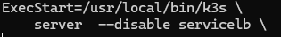

Next, create a file named load-balancer.yaml. This configuration will assign an IP address to the Traefik service, which is shipped by default with K3S:

```
apiVersion: metallb.io/v1beta1
kind: IPAddressPool
metadata:
 name: first-pool
 namespace: metallb-system
spec:
 addresses:
 - {your-address-pool} 
---
apiVersion: metallb.io/v1beta1
kind: L2Advertisement
metadata:
 name: example
 namespace: metallb-system
```

Apply the configuration: `kubectl apply -f load-balancer.yaml `

We execute the command `kubectl get all --all-namespaces` to verify whether the IP address has been correctly assigned to the Traefik service.

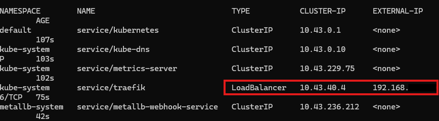

### 2.2 Traefik dashboard and DNS.

Now, we'll deploy the Traefik dashboard to graphically display information about the services managed by the ingress controller.

#### Config files:


Plik traefik-dashboard.yaml:

**IMPORTANT NOTE: In the `Host(your.domain.name)` field, you can specify a domain name, even if it is not publicly registered. However, you will need to handle it manually. Of course, you can use your own publicly registered domain name.**

```
apiVersion: traefik.containo.us/v1alpha1
kind: IngressRoute
metadata:
  name: dashboard
  namespace: kube-system
spec:
  entryPoints:
    - web
  routes:
    - match: Host(`your.domain.name`) && (PathPrefix(`/dashboard`) || PathPrefix(`/api`))
      kind: Rule
      services:
        - name: api@internal
          kind: TraefikService
```

File traefik-dashboard-service.yaml

```
apiVersion: v1
kind: Service
metadata:
  name: traefik-dashboard
  namespace: kube-system
  labels:
    app.kubernetes.io/instance: traefik
    app.kubernetes.io/name: traefik-dashboard
spec:
  type: ClusterIP
  ports:
  - name: traefik
    port: 9000
    targetPort: traefik
    protocol: TCP
  selector:
    app.kubernetes.io/instance: traefik-kube-system
    app.kubernetes.io/name: traefik
```
File traefik-dashboard-ingress.yaml

```
apiVersion: networking.k8s.io/v1
kind: Ingress
metadata:
  name: traefik-ingress
  namespace: kube-system
  annotations:
    spec.ingressClassName: traefik
spec:
  rules:
    - host: your.domain.name
      http:
        paths:
          - path: /
            pathType: Prefix
            backend:
              service:
                name: traefik-dashboard
                port:
                  number: 9000
```

Apply the configuration using the following command: 
`kubectl apply -f traefik-dashboard.yaml -f traefik-dashboard-ingress.yaml -f traefik-dashboard-service.yaml`

### 2.2.1 DNS

Now, we need to configure DNS settings to use domain names in the browser.

#### 2.2.1.1 File /etc/hosts

Add the IP address assigned by the load balancer and the name you will use to access the dashboard to the file.

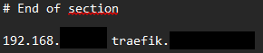

After saving the file, enter the following address in your browser: 

`http://traefik.{your-domain}/dashboard/#/`

The dashboard should appear:

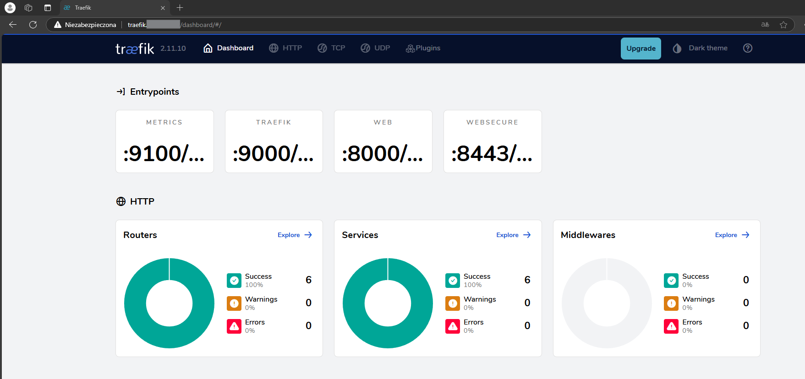

Later, I'll show how to enable HTTPS communication.

#### 2.2.1.2 Adguard Home

If you have AdGuard Home configured in your home lab, you can use it for DNS rewrites.

If you don't have AdGuard Home, I recommend checking this guide: [Docker home-lab](`https://xhub50n.github.io/DockerHomeLab/`)

In the Filters > DNS Rewrites tab, add an entry like the one shown below.

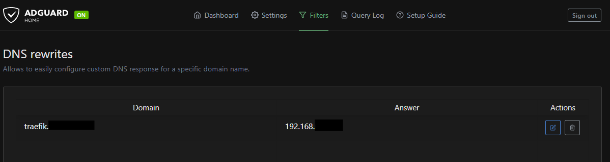

Once again, you can enter the following address in your browser: `http://traefik.{your-domain}/dashboard/#/` This will take you to the Traefik dashboard.

## 2.3 Container deployment

### 2.3.1 Create configmap, deployment and service

First, create a file named index.html containing your website's content:

```
<html>
<head>
  <title>PAGE</title>
  <style>
    html {
      font-size: 500.0%;
      font-family: 'Arial', sans-serif;
    }
    body {
      margin: 0;
      height: 100vh;
      background: linear-gradient(to bottom right, #ff7f7f, #ff0000);
      display: flex;
      justify-content: center;
      align-items: center;
    }
    div {
      text-align: center;
      color: #ffffff;.
      text-shadow: 2px 2px 4px rgba(0, 0, 0, 0.5);
    }
  </style>
</head>
<body>
  <div>Your page!</div>
</body>
</html>
```
Deploy the ConfigMap using the command: ` kubectl create configmap demo-html --from-file index.html`

Then, create a file named nginx-demo.yaml

```
apiVersion: apps/v1
kind: Deployment
metadata:
 labels:
  run: nginx
 name: nginx-deploy-demo
spec:
  replicas: 1
  selector:
    matchLabels:
      run: nginx-demo
  template:
    metadata:
      labels:
        run: nginx-demo
    spec:
      containers:
      - name: nginx-demo
        image: nginx
        ports:
          - containerPort: 80
        volumeMounts:
        - name: html-demo
          mountPath: /usr/share/nginx/html
      volumes:
      - name: html-demo
        configMap:
          name: demo-html

---
apiVersion: v1
kind: Service
metadata:
  name: nginx-demo
  labels:
    app: nginx
spec:
  ports:
  - port: 80
    protocol: TCP
  selector:
    run: nginx-demo
```

Deploy your container and service using the following command: `kubectl apply -f nginx-demo.yaml`

Check whether the deployment is running. As shown below, both the container and the service are operational:
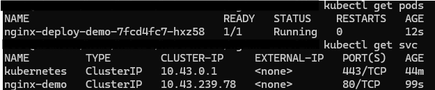

### 2.3.2 Create ingressroute

Next, we'll expose our website via Traefik to make it accessible in the browser.

Create a file named ingressroute.yaml

```
apiVersion: traefik.containo.us/v1alpha1
kind: IngressRoute
metadata:
  name: nginx
  namespace: default
spec:
  entryPoints:
    - web
  routes:
    - match: Host(`page.{your-domain}`)
      kind: Rule
      services:
        - name: nginx-demo
          port: 80
```

Apply the changes using the command: `kubectl apply -f ingressroute.yml`

Now, we can use the Traefik dashboard to check if our IngressRoute is working:

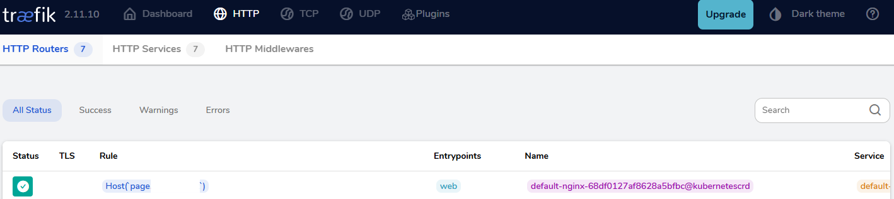

As you can see, everything is in order. We still need to add our website to the DNS system. I will do this in AdGuard Home.

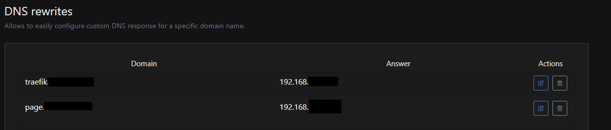

You can enter the following address in your browser: `http://page.{your-domain}/`

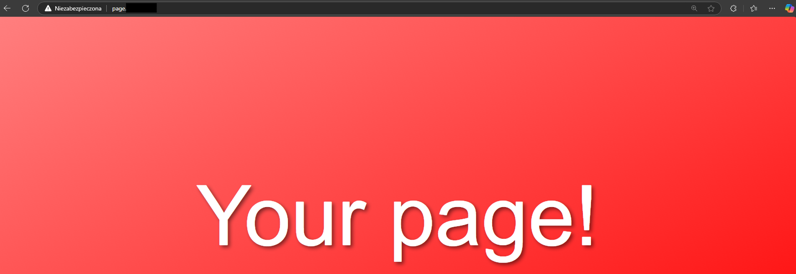

## 2.4 Cert-manager and certificates

**A domain registered with Cloudflare is required at this stage!**

First, we need to install the Helm package manager to enable the installation of Cert-Manager.

```
curl -fsSL -o get_helm.sh https://raw.githubusercontent.com/helm/helm/main/scripts/get-helm-3
chmod 700 get_helm.sh
./get_helm.sh
```
Next, we need to add the Cert-Manager repository.

```
export KUBECONFIG=/etc/rancher/k3s/k3s.yaml

helm repo add jetstack https://charts.jetstack.io

helm repo update

kubectl create namespace cert-manager

kubectl apply -f https://github.com/cert-manager/cert-manager/releases/download/v1.9.1/cert-manager.crds.yaml

```

Create a file named vaules.yaml

```
installCRDs: false
replicaCount: 3
extraArgs:
  - --dns01-recursive-nameservers=1.1.1.1:53,9.9.9.9:53
  - --dns01-recursive-nameservers-only
podDnsPolicy: None
podDnsConfig:
  nameservers:
    - "1.1.1.1"
    - "9.9.9.9"
```

Run the Cert-Manager installation command.

`helm install cert-manager jetstack/cert-manager --namespace cert-manager --values=values.yaml --version v1.9.1`

Create a file named secrets.yaml

```
apiVersion: v1
kind: Secret
metadata:
  name: cloudflare-token-secret
  namespace: cert-manager
type: Opaque
stringData:
  cloudflare-token: token
```
Deploy secret: `kubectl apply -f secret.yaml`

Create a file named clusterissuer.yaml

```
apiVersion: cert-manager.io/v1
kind: ClusterIssuer
metadata:
  name: letsencrypt-prod
spec:
  acme:
    email: your-mail
    server: https://acme-v02.api.letsencrypt.org/directory
    privateKeySecretRef:
      name: letsencrypt-prod
    solvers:
      - dns01:
          cloudflare:
            email: your-mail
            apiTokenSecretRef:
              name: cloudflare-token-secret
              key: cloudflare-token
        selector:
          dnsZones:
            - "your-domain"
```

Apply `kubectl apply -f cloudflare-clusterissuer.yaml`

Deploy the certificate by creating a file named: cert-production.yaml

```
apiVersion: cert-manager.io/v1
kind: Certificate
metadata:
  name: nginx-cert
  namespace: default
spec:
  secretName: nginx-cert
  issuerRef:
    name: letsencrypt-prod
    kind: ClusterIssuer
  commonName: "*.{your-domain}"
  dnsNames:
    - "{your-domain}"
    - "*.{your-domain}"
```

Apply the certificate deployment: `kubectl apply -f cert-production.yaml`

Check if the certificate was issued with the following command: `kubectl get cert`

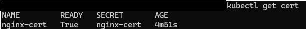

The certificate has been issued!

Now we need to update the ingressroute.yaml file.

```
apiVersion: traefik.containo.us/v1alpha1
kind: IngressRoute
metadata:
  name: nginx
  namespace: default
spec:
  entryPoints:
    - websecure
  routes:
    - match: Host(`page.{your-domain}`).
      kind: Rule
      services:
        - name: nginx-demo
          port: 80
  tls:
    secretName: nginx-cert
```

`kubectl apply -f ingressroute.yaml`

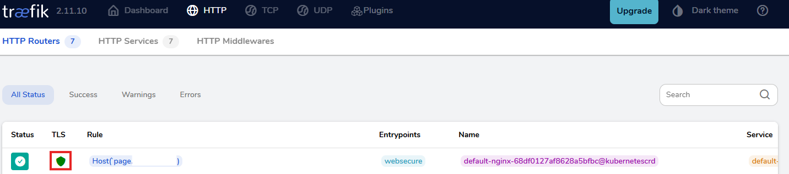

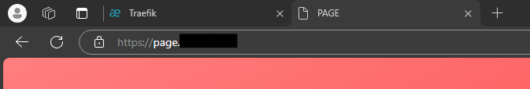

We successfully deployed the website with HTTPS.